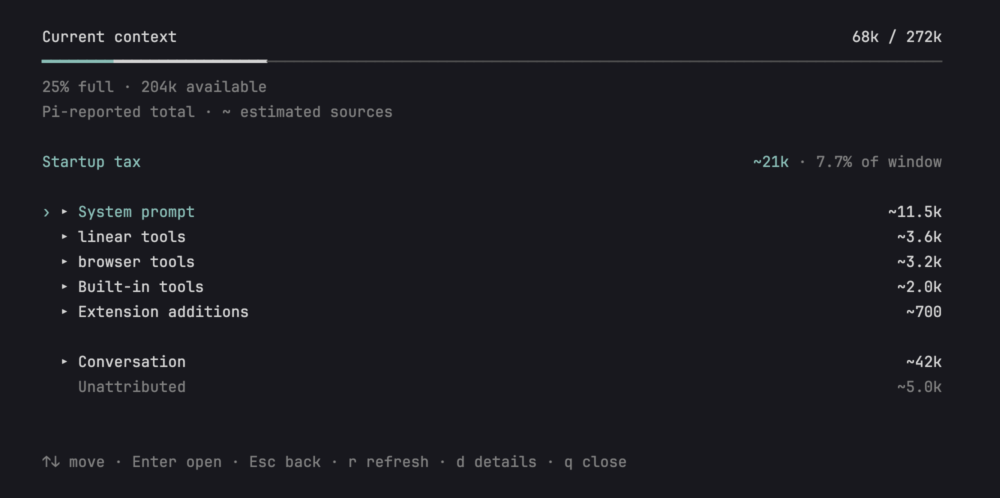
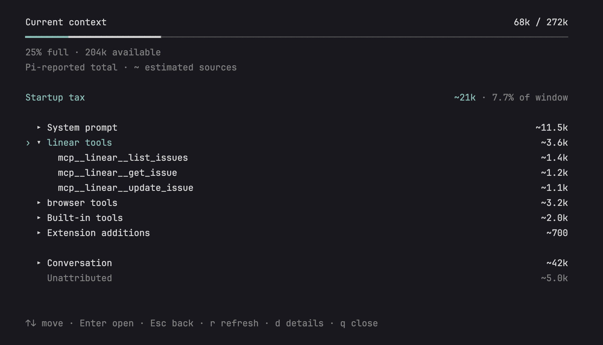
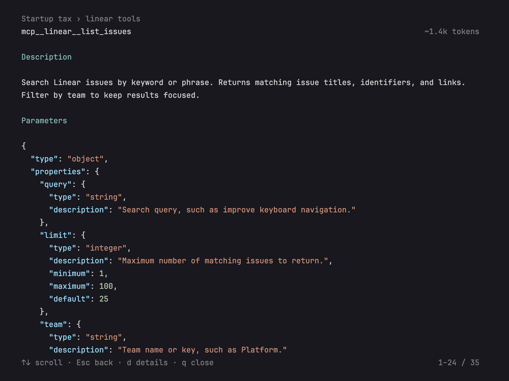
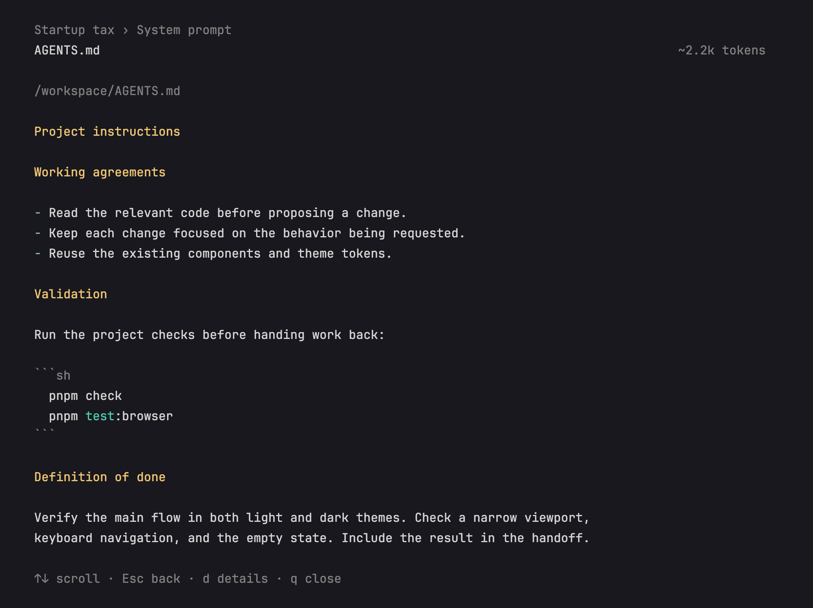
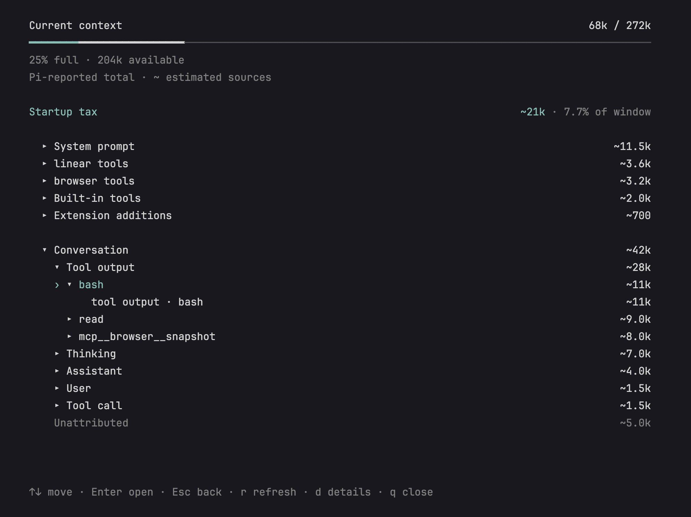
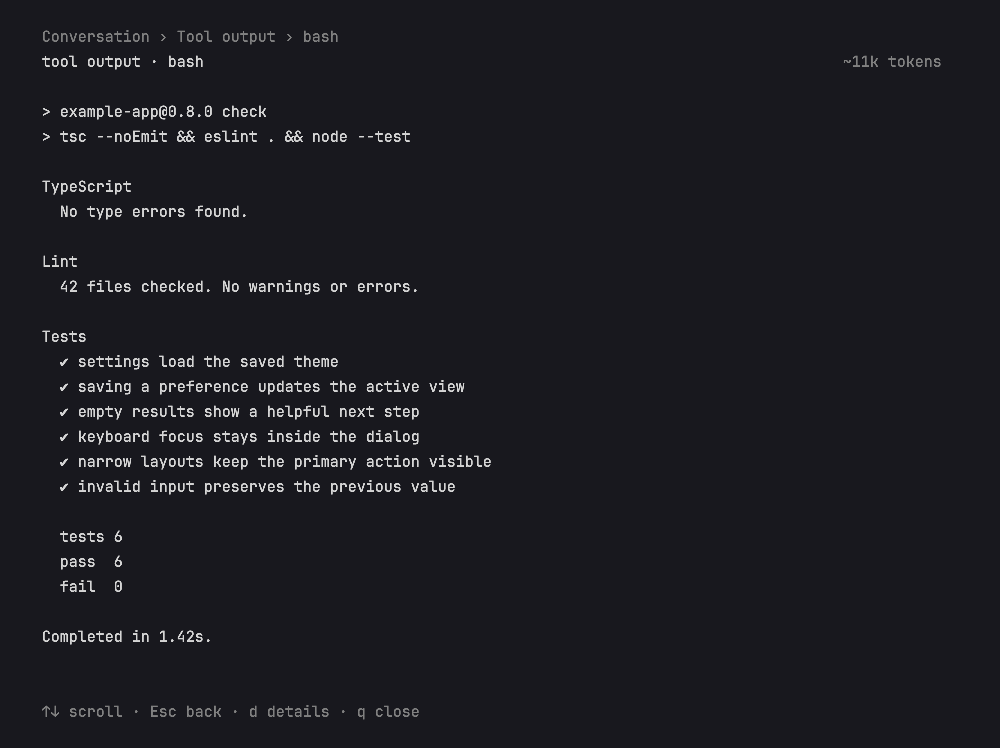

# pi-context-tax

Part of how I work is shipping slop and then converging. I try things, see what sticks, and clean up as I go. My coding environment goes through the same cycle: I try new skills, plugins, and MCPs, and end up keeping things around that I don't need in the long term.

That comes with a startup tax. You open a fresh coding session and 10,000, 20,000, or even 50,000 tokens of your context window can already be taken up by tool definitions and instructions, before you've asked it to do anything.

I've become obsessed with keeping my context clean and my startup tax low. I built `pi-context-tax` to see what's taking up that space, so I can decide what to keep and what to remove.

`pi-context-tax` is a [Pi](https://pi.dev) extension that shows where your context window goes. Run `/ctx` to see current usage, available space, and your largest startup costs. Expand a source to inspect its tools, skills, or instructions. The conversation stays collapsed until you want to explore it, and the panel follows your Pi theme.

## Showcase

These screenshots use illustrative session data with Linear and browser tools, rendered by the extension.

### Current context

<picture>
  <source media="(prefers-color-scheme: light)" srcset="docs/context-overview-light.png">
  
</picture>

### Tool definitions

Expand a provider to see its active tools, then open one for its description, formatted parameters, and source.





### Instructions

Read the instructions behind a source, with its file path and estimated contribution.



<details>
<summary>Explore the conversation and tool output</summary>

The conversation expands into messages, tool calls, and outputs. Follow a tool to an individual result; long sources scroll without losing their title or token count.





</details>

## Quick start

Install the extension:

```sh
pi install npm:pi-context-tax
```

You can also install directly from GitHub with `pi install git:github.com/Roshvan/pi-context-tax`. Start Pi as usual, then run `/ctx` to open the panel. If Pi is already running, use `/reload` first.

- `↑` / `↓`: move
- `Enter` / `→`: expand a row or read its source
- `Esc` / `←`: go back (`Esc` closes at the top level)
- `r`: refresh
- `d`: toggle session details, including skills, context files, command sources, and cumulative usage
- `q`: close

Use `Page Up` / `Page Down` to move faster and `Home` / `End` to jump to either end. Source text and session details scroll with the same keys. Opening details from a source and pressing `Esc` returns you to the same place.

Outside the interactive terminal interface, `/ctx` prints a plain-text summary. It adds no model-facing tools, and opening it does not add a message to the model's context.

Startup tax means the tools and standing instructions in your **current** context, including the skill catalog and extension additions. It updates as your environment changes. Loaded skill contents and tool results belong to the conversation.

Source counts are estimates, marked `~`. The total uses compatible Pi-reported usage when available, with estimates for newer messages; otherwise it is estimated too. The panel labels which it is. If the source estimates exceed the reported total, they are scaled proportionally to fit it. Any remaining difference is shown as `Unattributed`. Later extension hooks and provider-specific formatting can affect the final context, so this is a guide to cleanup rather than exact billing.

A label such as `Built-in tools · pi-zen` means that extension re-registers Pi’s built-in tools with unchanged descriptions and schemas. Those definitions are counted once; they are not extra tools. An extension that changes a built-in definition is labeled `Built-in overrides` instead.

## Development

You will need Node.js 22.19 or newer, pnpm, and Pi 0.84.3–0.85.x. Clone the repository, install the dependencies, and start Pi with the local extension:

```sh
git clone https://github.com/Roshvan/pi-context-tax.git
cd pi-context-tax
pnpm install
pnpm dev
```

Before submitting a change, run `pnpm check` and `pnpm pack:check`. Maintainer instructions are in [Releasing](docs/RELEASING.md).

## Issues and contributions

Issues and pull requests are welcome. If you have an idea, find a bug, or want to improve something, feel free to open an issue or create a pull request. I am happy to look it over.

## License

MIT
